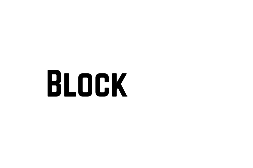

	
	

    <a href="https://devfolio.co/projects/blockboard-0366">Devfolio Showcase</a>
		 
		<a href="#triangular_flag_on_post-the-problem">The Problem</a>
		·
		<a href="#bulb-the-solution">The Solution</a>
  	

	 

 

# :triangular_flag_on_post: The Problem
A few companies monopolize the advertising space in cities, leaving everyday individuals with no opportunity for involvement.
Meanwhile, companies seeking to promote their products are bound by the limitations that the advertising monopoly sets.

# :bulb: The Solution
We offer the possibilty for everyone to participate by creating a decentralised platform where people wanting to sell advertising space can meet companies wanting to advertise their product.
Standardized digital billboards are available for purchase, but individuals can also use their own billboards. Once registered and put in place, they can be forgotten and they will provide a passive income for the foreseeable future.

For businesses, this offers major advantages. Due to the permittionless nature of blockchains, they can decide exactly where and how they want to advertise their product, e.g. by using a Gelato bot.
Coffee can be advertised between 5-10am, beer can be advertised in the evening and ice cream can be advertised when its above 25°C outside, all based on whatever algorithm the advertising company wants to implement.
To fit these needs, we implemented an on-chain dynamic pricing market, where companies can compete for billboards globally.

Since companies are not yet ready for blockchain we provide them with a service to buy the tokens for them, essentially acting as a trusted intermediary.
